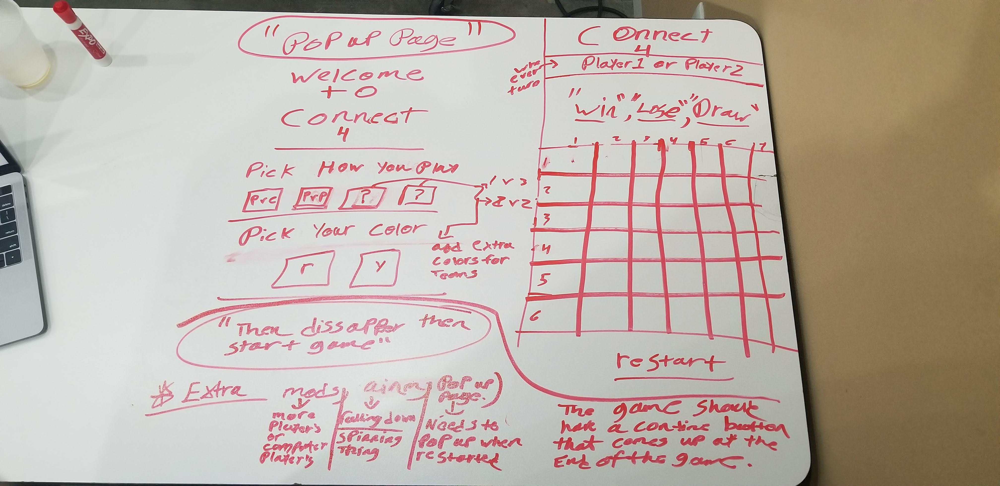

# Project-1---Connect-4
General Assembly SEI December 2 # Project-1---Connect-4

Project: Connect 4
- Trello Board: [Trello Board Link](https://trello.com/invite/b/dcXSDXNb/47744d2fa1dd9fe09426eadd462fa59e/project-1)
- Github: [Github Link](https://github.com/IanGitHub2/Project-1---Connect-4)
- Website: [Website link](https://infallible-mcnulty-f386b4.netlify.com)

## Overview
  I have created Connect 4. I used to play connect 4 a lot when i was younger. 

### How it works
  The user waves their curser over the top of the boared and you will see a chip apper at the top. Click the colum you want to drop the chip in. the chip drops right above the last chip in the colum or to the bottom.

### WireFrame

### Used to create the game
- Languages: HTML5, CSS3, Javascript
- Design: Bootstrap
- Made with: VS CODE

### More to come
Ainimations for the chip to falling in to place.
The setting for the game will pop-up before the game starts or when the game is won,lost or a draw.